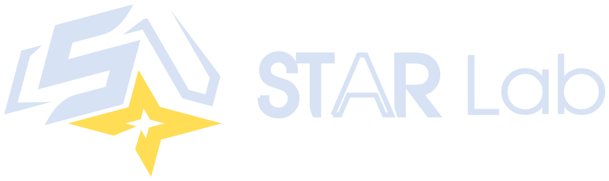
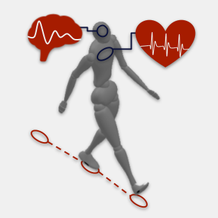
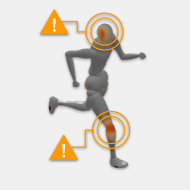
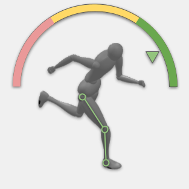

---
# Feel free to add content and custom Front Matter to this file.
# To modify the layout, see https://jekyllrb.com/docs/themes/#overriding-theme-defaults

layout: home
img_logo: /assets/img/logo-dark-transparent.png
---

    

___

Raising the bar.

The performance team at the Sports Trauma & Applied Research Lab conducts research focused on the health & performance of team sport athletes, all the way from evaluation to optimization.

 
<table>
    <tr style="font-weight: bold; font-size: 1.4rem; text-align: center;" class="title-head">
        <td>Evaluation</td>
        <td>Prevention</td>
        <td>Optimization</td>
    </tr>
    <tr>
        <td>
            
        </td>
        <td>
            
        </td>
        <td>
            
        </td>
    </tr>
    <tr>
        <td class="text-body">Systematically assess athletes through cutting-edge technology & comprehensive physiological metrics</td>
        <td class="text-body">Proactively mitigate athlete injuries through personalized & evidence-based methods to foster sustained performance.</td>
        <td class="text-body">Maximize athlete performance through personalized, data-driven analyses, to ensure both athletes & teams reach their full potential.</td>
    </tr>
</table>

    
Lab Director

    
Dr. Louis De Beaumont

    

        Dr. Louis de Beaumont specializes in researching concussions and traumatic brain injuries, with a focus on their effects in athletes. His work examines changes in brain structure and function post-concussion and explores biomarkers for prevention, diagnosis, and treatment.
    

